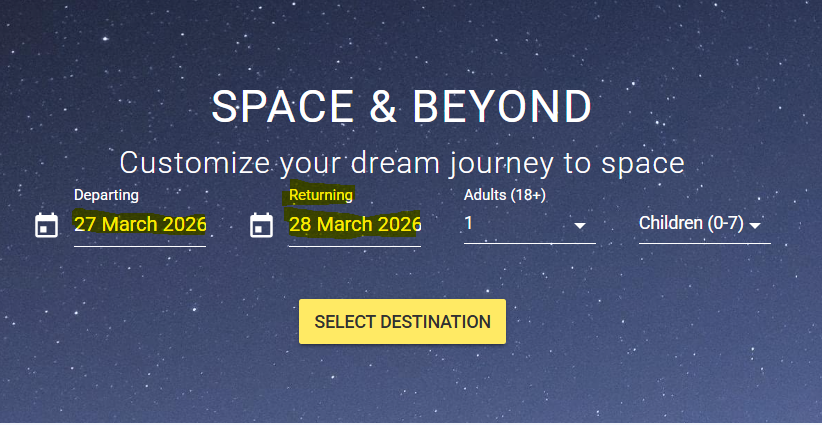

## Bug Report: Invalid Date Selection 

**Status:** 🔴 Open  
**Severity:** High (Business Logic Violation)  
**Priority:** High  

### Description
When a user selects **"Today"** as the return date in the Space Advisor search feature, the system automatically sets the **Departure Date** to today and sets the **Returning Date** as tomorrow.

## Test Case Failed: US02-Select-Destination --> TC-01 Valid Travel Selection (Happy Path)

###  Steps to Reproduce
1. Navigate to the Space Advisor search/booking page https://demo.testim.io/.
2. Go to the **"Returning"** date picker.
3. Select the current date.
4. Click on "Select Destination" button.
5. Observe the **"Departing"** and **"Returning"** date field.

### ❌ Actual Result
The "Departing" field is automatically populated with today date and the "Returning" field is automatically populated with tommorrow date. 

### ✅ Expected Result
The "Departing" date and the "Returning" date should never change to another date when the user picks a date and clicks the "Select Destination" button. 

### Evidence

---

