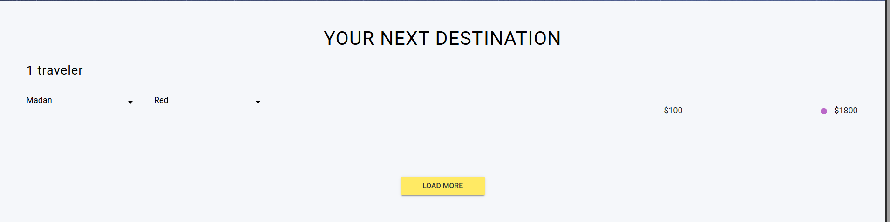

# Bug Report: Residual "Load More" button on invalid filter combinations

**ID:** BUG_US03_001  

**User Story:** US_03 - Browse and Filter Destinations

**Test Case Failed:** US03-Browse-and-Filter-Destinations --> TC_05 Negative Filtering (No Matching Results)  

**Priority:** Medium  

**Severity:** Minor (UI/UX Inconsistency)  

**Status:** 🔴 Open  

**Environment:** https://demo.testim.io/destinations

---

### Description
A UI inconsistency was found when applying a **Planet** and **Color** combination that results in zero matches (e.g., *Madan* + *Red*). While the destination grid correctly clears to show no results, a **"Load More"** button remains visible at the bottom of the section. This button is non-functional and should be hidden when the result count is 0.

### Steps to Reproduce
1. Navigate to the **"Your Next Destination"** gallery section.
2. Select a planet from the **"Launch"** dropdown (e.g., **"Madan"**).
3. Select a color that is **not available** for that specific planet (e.g., **"Red"**).
4. Scroll to the bottom of the filtered results area.

### ❌ Actual Result
The grid is empty as expected, but the **"Load More"** button is still rendered and visible. Clicking it does not trigger any action, load data, or show a "No results" message.

### ✅ Expected Result
If the filter combination returns **0 results**, the "Load More" button must be hidden or removed from the DOM. Ideally, a "No destinations found for this criteria" message should be displayed to the user.

### Evidence

---

### Technical Environment

* **Browser:** Chrome (Latest Version)
* **Device:** Desktop / Windows 11
* **Date:** April 2026

---
