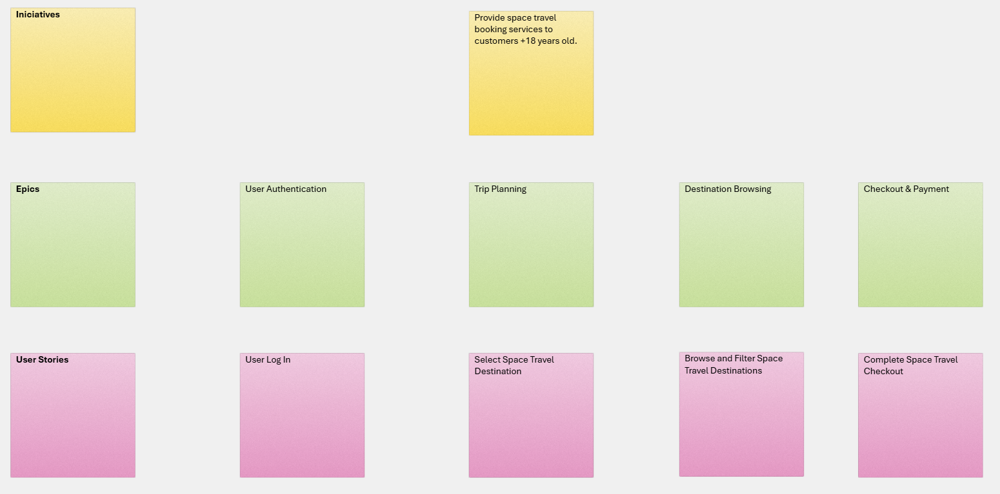

# Requirement Analysis: Space Advisor

Since this website is intended only for learning and practice purposes, it does not provide functional documentation. Therefore, I created **assumed requirements documentation** based on my interpretation of the expected system behavior.

## User Story Mapping
To organize the functionalities and ensure **bidirectional traceability**, I developed the following mapping:

### User Story Mapping & Requirements

To establish **bidirectional traceability** and define the project scope, I created the following **User Story Mapping**. This visual guide helps to focus testing activities on core user flows and technical requirements.

> [!TIP]
> Each sticky note represents a specific user story with defined acceptance criteria and corresponding test cases.

> [!TIP]
> This mapping serves as the foundation for the Test Scenarios and ensures that every business goal is covered by technical validation.
