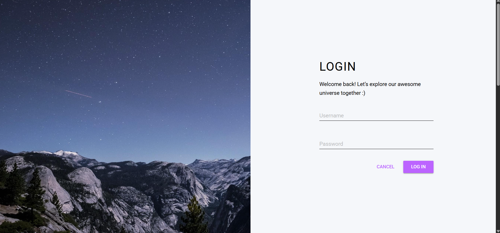
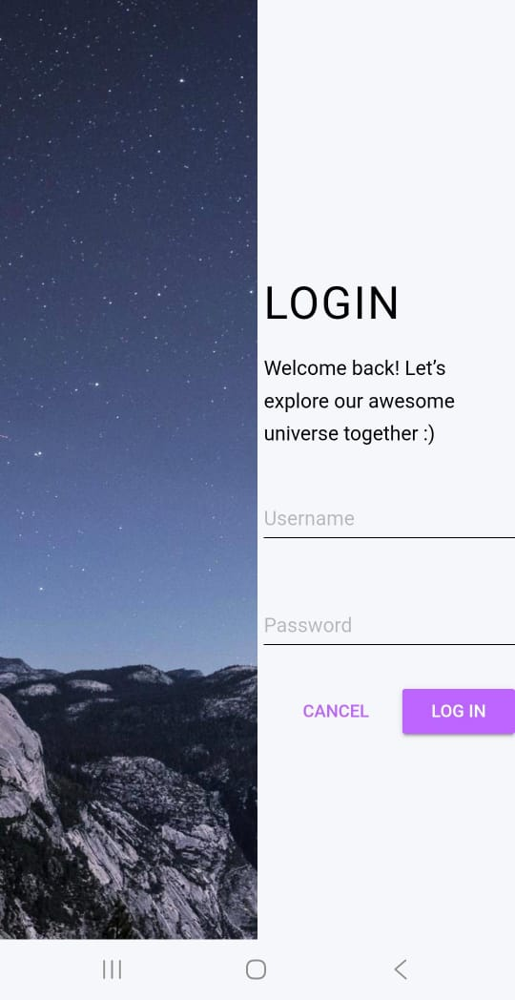

# Test Documentation: User Log In (US_01)

## 🎯 1. User Story Description
**As an** end user,  
**I need to** be able to log in using my username and password,  
**So that** I can securely access my account and personal travel bookings.

---

## 🛠️ 3. Test Strategy & Techniques
For this feature, I applied the following design techniques to ensure quality:
* **Use Case Testing:** Validating the primary flow (Happy Path).
* **Equivalence Partitioning (EP):** Grouping invalid credentials to optimize test coverage.
* **State Transition:** Verifying the "Cancel" button's ability to return the system to its initial state.

---

## 📸 5. Evidence & UI Verification

*Visual verification of the login interface (Desktop vs Mobile).*
