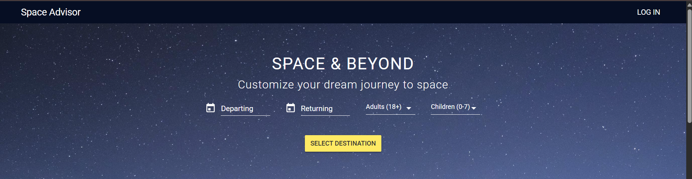
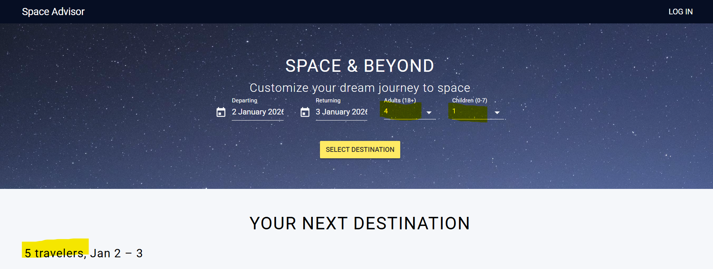

# Test Documentation: Select Space Travel Destination (US_02)

##  1. User Story Description

**As an** end user,

**I want to** select travel details such as departure date, return date, and number of passengers from the hero banner,

**So that** I can proceed to the next step and view available space travel destinations.

##  2. Test Strategy & Techniques

For this feature, I applied the following design techniques to ensure data integrity and a seamless user experience:

* **Boundary Value Analysis (BVA):** Validating the minimum (1) and maximum (4) limits of the passenger dropdowns to ensure the system handles edge cases correctly.
* **Equivalence Partitioning (EP):** Dividing date selections into valid (future dates) and invalid (past dates or return before departure) groups to optimize coverage.
* **Data Integrity Testing:** Verifying that the data entered in the hero banner (dates and traveler count) is accurately calculated and reflected in the results grid.
* **Business Logic Validation:** Testing the system's ability to automatically correct or default values (e.g., setting Adults to 1 if left empty) as per the requirements.**

* ## 3. Evidence & UI Verification

