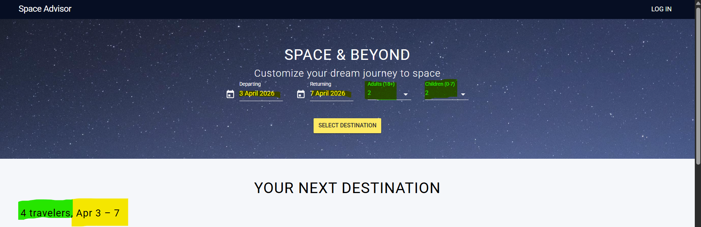
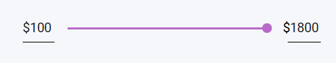

## Acceptance Criteria

### 1. Destination List Display
* **Grid visibility:** Verify that a grid containing all available space travel destinations is displayed correctly.
* **Filtering trigger:** Verify that clicking the **"Select Destination"** button correctly filters the destinations below based on current selections.
* **Card content:** Verify that each destination card includes:
    * Image of the destination.
    * Destination name & description.
    * Price.
    * A functional **'Book'** button.

### 2. Traveler and Date Summary Information
* **Default state:** Verify that the 'Traveler and date summary information' bar shows **"1 traveler"** by default.

* **Dynamic date and travelers update:** Verify that when dates and travelers are selected in the picker, they appear in the summary with the format: `[Amount Travelers], [Month] [Day] - [Day]`.
    * *Example:* Selecting Apr 3 (Departing) and Apr 7 (Returning) should display **"Apr 3 - 7"**.
    * *Example:* Selecting 2 (Adults (+18)) and 2 (Children(0-7)) should display **"4 travelers"**.

* **Data integrity:** Verify that the traveler count and dates reflect the exact values selected in the hero banner.

### 3. Destination Filters (Launch & Planet Color)
* **Launch filter:** Verify that the "Launch" dropdown is visible, enabled, and contains: *Madan, Shenji, Tongli, Flagstaff, Sant Cugat Del Valles, Shaheying, Tayabamba, Babahoyo, Cuozhou.*
* **Color filter:** Verify that the "Planet Color" dropdown is visible, enabled, and contains: *Green, Red, Blue, Brown, Purple.*
* **Dynamic updates:** Verify that selecting or clearing these filter values updates the displayed results grid immediately.

### 4. Price Range Filter
* **Functionality:** Verify that the price range slider is visible and functional.

* **Limits:** Verify that minimum ($100) and maximum ($1800) price values are displayed and respected.
* **Result filtering:** Verify that any destination outside the selected range is hidden from the grid.

### 5. Booking & Cards Behavior
* **State Transition:** Verify that clicking **'BOOK'** changes the button state to **'BOOKED'** and adds a check icon in the upper right corner of the card.

 
* **Session Persistence:** Verify that clicking 'BOOK' successfully captures the item's unique identifier and redirects to the **Checkout page** with the item in the session.
* **UI Resilience:** * Verify layout stability on different screen sizes.
    * Verify that clicking the card body (image/text) does nothing (read-only).
    * Verify that long titles or broken images do not break the card's design.
 
### 6. Checkout Process & Forms
* **Form Fields:** Verify that the Checkout page displays fields for: *Name, Email Address, Social Security Number, and Phone Number.*
* **Order Summary:** Verify that the "Order Summary" correctly displays:
    * Selected Dates (e.g., Jan 3 - 16).
    * Number of travelers.
    * Unit price and Total price (calculated correctly).
* **Promo Code:** Verify that the 'I have a promo code' field is visible and the 'APPLY' button is functional.
* **Health Insurance Upload:** Verify that the drag-and-drop area for "Health insurance" is visible and accepts file uploads.

### 7. Destination Insights (Contextual Info)
* **Temperature Graph:** Verify that when a destination is booked (e.g., Shenji), a yearly temperature graph/chart is displayed to help the user pack accordingly.
