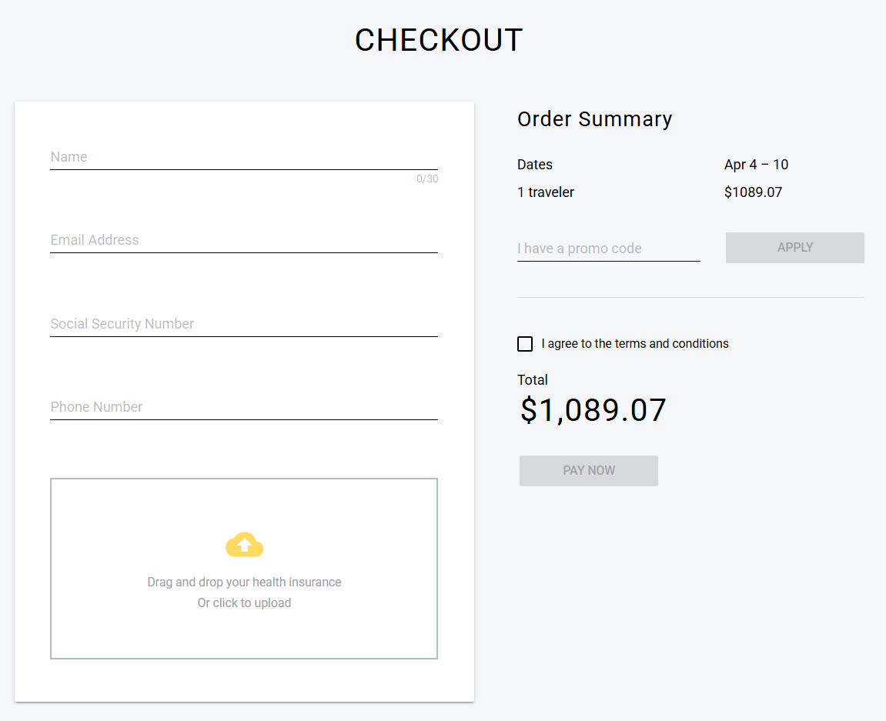
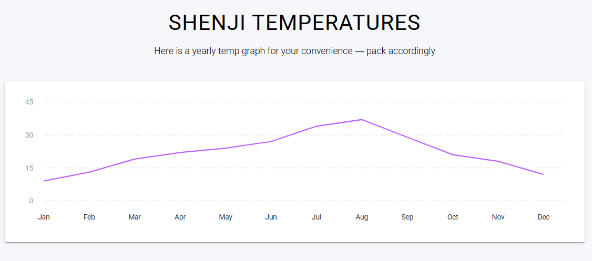

# Acceptance Criteria: Complete Space Travel Checkout (US_04)

The following criteria define the mandatory requirements for a successful Checkout process. Each point must be verified to ensure the feature is "Done".

### 1. Booking & Cards Behavior
* **State Transition:** Verify that clicking **'BOOK'** changes the button state to **'BOOKED'** and adds a check icon in the upper right corner of the card.

 
* **Session Persistence:** Verify that clicking 'BOOK' successfully captures the item's unique identifier and redirects to the **Checkout page** with the item in the session.
* **UI Resilience:** * Verify layout stability on different screen sizes.
    * Verify that clicking the card body (image/text) does nothing (read-only).
    * Verify that long titles or broken images do not break the card's design.
 
### 2. Checkout Process & Forms
* **Form Fields:** Verify that the Checkout page displays fields for: *Name, Email Address, Social Security Number, and Phone Number.*
* **Order Summary:** Verify that the "Order Summary" correctly displays:
    * Selected Dates (e.g., Apr 4 - 10).
    * Number of travelers.
    * Unit price and Total price (calculated correctly).
* **Promo Code:** Verify that the 'I have a promo code' field is visible and the 'APPLY' button is functional.
* **Health Insurance Upload:** Verify that the drag-and-drop area for "Health insurance" is visible and accepts file uploads.

### 3. Destination Insights (Contextual Info)
* **Temperature Graph:** Verify that when a destination is booked (e.g., Shenji), a yearly temperature graph/chart is displayed to help the user pack accordingly.

### 4. Mandatory Field Enforcement (Button State)
Verify that the **"PAY NOW"** button remains disabled or shows an error if the user leaves the personal information fields (**Name, Email, Phone**) empty.

### 5. Legal Compliance (Terms & Conditions)
Verify that the user **cannot proceed** with the payment if the **"I agree to the terms and conditions"** checkbox is unchecked.

### 6. Input Validation & Visual Feedback
Verify that the user cannot proceed with payment if any of the following fields are empty or invalid: 
* **Name**
* **Email Address**
* **Social Security Number** (Format: xxx-xx-xxxx)
* **Phone Number** (AR format)

**Note:** If any field is invalid, a specific warning message must appear directly above each empty/incorrect field (e.g., *"Name is a required field"*, *"Enter a valid e-mail address"*).
